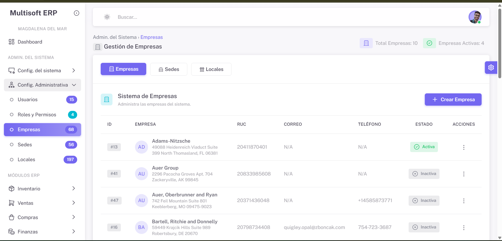

# 🏢 ERP Sistema de Gestiín general

<div align="center">


**Sistema ERP moderno y escalable construido con Laravel**

[🚀 Demo](#demo) • [📖 Documentación](#documentación) • [🛠️ Instalación](#instalación) • [🤝 Contribuir](#contribuir)

</div>

## 📋 Tabla de Contenidos

- [✨ Características](#-características)
- [🏗️ Arquitectura](#️-arquitectura)
- [🛠️ Instalación](#️-instalación)
- [⚙️ Configuración](#️-configuración)
- [📚 Módulos](#-módulos)
- [🔐 Seguridad](#-seguridad)
- [🎨 Interfaz de Usuario](#-interfaz-de-usuario)
- [📖 Documentación](#-documentación)
- [🧪 Testing](#-testing)
- [🚀 Deployment](#-deployment)
- [🤝 Contribuir](#-contribuir)
- [📄 Licencia](#-licencia)

---

## ✨ Características

### 🚀 **Características Principales**
- **Sistema ERP Completo** - Gestión integral de empresas
- **Multi-tenant** - Soporte para múltiples empresas
- **Gestión de Sedes** - Control de sucursales y ubicaciones
- **Sistema de Permisos** - Control granular con Spatie Permissions
- **Superadministradores** - Sistema avanzado de privilegios
- **Interfaz Moderna** - UI/UX basada en Vuexy template

### 🔧 **Tecnologías**
- **Backend**: Laravel 11.x con PHP 8.2+
- **Frontend**: Livewire 3.x + Alpine.js + Bootstrap 5.3
- **Base de Datos**: MySQL 8.0+ con migraciones automáticas
- **Autenticación**: Laravel Sanctum + Sistema de permisos
- **Caché**: Redis (opcional) + File cache
- **Colas**: Laravel Queues para tareas en background

### 🎯 **Características Técnicas**
- **Arquitectura MVC** con patrones Repository y Service
- **DataTables Dinámicos** con filtrado, ordenamiento y paginación
- **Componentes Livewire** reactivos y reutilizables
- **API RESTful** documentada y versionada
- **Sistema de Logs** completo y auditoría
- **Seeders y Factories** para datos de prueba
- **Comandos Artisan** personalizados

---

## 🏗️ Arquitectura

### 📁 **Estructura del Proyecto**
```
erp-multisoft/
├── 📂 app/
│   ├── 📂 Console/Commands/         # Comandos Artisan personalizados
│   ├── 📂 Http/
│   │   ├── 📂 Controllers/         # Controladores del sistema
│   │   │   └── 📂 Erp/            # Controladores ERP específicos
│   │   ├── 📂 Middleware/         # Middleware personalizado
│   │   └── 📂 Requests/           # Form Requests de validación
│   ├── 📂 Livewire/
│   │   └── 📂 Erp/                # Componentes Livewire ERP
│   ├── 📂 Models/
│   │   └── 📂 Erp/                # Modelos del sistema ERP
│   ├── 📂 Policies/               # Políticas de autorización
│   ├── 📂 Providers/              # Service Providers
│   └── 📂 Traits/                 # Traits reutilizables
├── 📂 database/
│   ├── 📂 migrations/             # Migraciones de base de datos
│   ├── 📂 seeders/                # Seeders para datos iniciales
│   └── 📂 factories/              # Factories para testing
├── 📂 resources/
│   ├── 📂 views/
│   │   ├── 📂 erp/                # Vistas del sistema ERP
│   │   ├── 📂 layouts/            # Layouts y componentes
│   │   └── 📂 livewire/           # Vistas de componentes Livewire
│   ├── 📂 css/                    # Estilos personalizados
│   └── 📂 js/                     # JavaScript y Alpine.js
├── 📂 routes/                     # Definición de rutas
├── 📂 config/                     # Archivos de configuración
└── 📂 docs/                       # Documentación del proyecto
```

---

## 🛠️ Instalación

### 📋 **Requisitos del Sistema**
- **PHP**: 8.2 o superior
- **Composer**: 2.x
- **Node.js**: 18.x o superior
- **MySQL**: 8.0 o superior
- **Apache/Nginx**: Servidor web configurado

### 🚀 **Instalación Rápida**

1. **Clonar el repositorio**
   ```bash
   git clone https://github.com/jneskenz/erp-multisoft.git
   cd erp-multisoft
   ```

2. **Instalar dependencias de PHP**
   ```bash
   composer install
   ```

3. **Instalar dependencias de Node.js**
   ```bash
   npm install
   npm run build
   ```

4. **Configurar el archivo de entorno**
   ```bash
   cp .env.example .env
   php artisan key:generate
   ```

5. **Configurar la base de datos en `.env`**
   ```env
   DB_CONNECTION=mysql
   DB_HOST=127.0.0.1
   DB_PORT=3306
   DB_DATABASE=erp_multisoft
   DB_USERNAME=root
   DB_PASSWORD=
   ```

6. **Ejecutar migraciones y seeders**
   ```bash
   php artisan migrate:fresh --seed
   ```

7. **Iniciar el servidor de desarrollo**
   ```bash
   php artisan serve
   ```


## ⚙️ Configuración

### 🔧 **Configuración Inicial**

#### Permisos y Roles
```bash
# Verificar permisos del sistema
php artisan permission:cache-reset

# Crear nuevo superadministrador
php artisan make:superadmin usuario@email.com

# Verificar seguridad de superadmins
php artisan check:superadmin-security
```

#### Configuración de Superadministradores
Editar `config/superadmin.php`:
```php
'allowed_emails' => [
    'superadmin@erpmuadminltisoft.com',
    'admin@tuempresa.com',
    // Agregar más emails autorizados aquí
],
```

### 🎨 **Personalización del Tema**

El sistema utiliza el tema **Vuexy** con Bootstrap 5.3. Para personalizar:

1. **Colores y variables**
   ```scss
   // resources/sass/_variables.scss
   $primary: #7367f0;
   $secondary: #82868b;
   $success: #28c76f;
   ```

2. **Compilar assets**
   ```bash
   npm run dev     # Desarrollo
   npm run build   # Producción
   ```

---

## 📚 Módulos

### 🏢 **Gestión de Empresas**
- ✅ **CRUD Completo** - Crear, leer, actualizar, eliminar
- ✅ **Validaciones Avanzadas** - RUC, razón social, email
- ✅ **Estados** - Activo/Inactivo con auditoría
- ✅ **Relaciones** - Con sedes y usuarios

#### Características:
- Gestión de documentos de identidad (RUC/DNI)
- Validación de datos fiscales
- Historial de cambios
- Exportación de datos

### 🏪 **Gestión de Sedes**
- ✅ **DataTable Avanzado** - Con filtros, ordenamiento y paginación
- ✅ **Búsqueda Inteligente** - Por nombre, empresa y descripción
- ✅ **Filtros Dinámicos** - Por empresa y estado
- ✅ **Paginación Elegante** - Navegación optimizada

#### Características del DataTable:
- **Filtrado en tiempo real** con debounce
- **Ordenamiento** por múltiples columnas
- **Paginación inteligente** con máximo 5 botones
- **Loading states** optimizados
- **Responsive design** para móviles

### 👥 **Sistema de Usuarios**
- ✅ **Roles y Permisos** - Sistema granular con Spatie
- ✅ **Superadministradores** - Acceso sin restricciones
- ✅ **Autenticación Segura** - Con verificación de email
- ✅ **Auditoría** - Logs de accesos y acciones

---

## 🔐 Seguridad

### 🛡️ **Características de Seguridad**

#### Sistema de Superadministradores
- **Lista hardcodeada** de emails autorizados
- **Doble validación** (flag + lista + email verificado)
- **Logs de seguridad** para intentos no autorizados
- **Comandos de auditoría** para verificar integridad

#### Protecciones Implementadas
- **CSRF Protection** en todos los formularios
- **XSS Protection** con escape automático
- **SQL Injection** prevención con Eloquent ORM
- **Middleware personalizado** para rutas críticas
- **Rate limiting** en APIs y formularios

#### Sistema de Permisos
```php
// Ejemplos de permisos implementados
'sedes.view'     // Ver sedes
'sedes.create'   // Crear sedes
'sedes.edit'     // Editar sedes
'sedes.delete'   // Eliminar sedes
'empresas.manage' // Gestionar empresas
```

---

## 🎨 Interfaz de Usuario

### 🖥️ **Diseño y UX**

#### Tema Vuexy
- **Dashboard moderno** con métricas en tiempo real
- **Navegación intuitiva** con sidebar colapsible
- **Componentes responsive** que se adaptan a todos los dispositivos
- **Dark/Light mode** (próximamente)

#### Componentes Principales
- **DataTables avanzados** con Livewire
- **Formularios dinámicos** con validación en tiempo real
- **Modals reutilizables** para acciones rápidas
- **Notificaciones toast** para feedback del usuario
- **Breadcrumbs inteligentes** para navegación

#### Iconografía
- **Tabler Icons** - Set completo de iconos modernos
- **Iconos consistentes** en toda la aplicación
- **Estados visuales** claros (activo/inactivo, etc.)

### 📱 **Responsive Design**

| Dispositivo | Breakpoint | Características |
|-------------|------------|-----------------|
| **Mobile** | < 768px | Menu colapsado, cards apilados |
| **Tablet** | 768px - 1024px | Sidebar adaptativo |
| **Desktop** | > 1024px | Layout completo |

---

## 📖 Documentación

### 📚 **Documentación Disponible**

| Documento | Descripción | Ubicación |
|-----------|-------------|-----------|
| **[Exclusividad SuperAdmin](docs/EXCLUSIVIDAD_SUPERADMIN.md)** | Guía completa de implementación de exclusividad | `docs/` |
| **[API Documentation](docs/API.md)** | Documentación de endpoints | `docs/` |
| **[Database Schema](docs/DATABASE.md)** | Esquema de base de datos | `docs/` |
| **[Deployment Guide](docs/DEPLOYMENT.md)** | Guía de despliegue | `docs/` |

### 🔧 **Comandos Artisan Personalizados**

```bash
# Gestión de Superadministradores
php artisan make:superadmin email@ejemplo.com        # Crear superadmin
php artisan make:superadmin email@ejemplo.com --revoke  # Revocar permisos
php artisan check:superadmin-security               # Auditar seguridad

# Gestión de Datos
php artisan db:seed --class=EmpresaSeeder          # Crear empresas de prueba
php artisan db:seed --class=SedesSeeder            # Crear sedes de prueba
php artisan db:seed --class=SuperAdminSeeder       # Crear superadmin

# Mantenimiento
php artisan erp:clear-logs                         # Limpiar logs antiguos
php artisan erp:optimize                           # Optimizar sistema
```

---

## 🚀 Deployment

### 🌐 **Despliegue en Producción**

#### Requisitos del Servidor
- **PHP 8.2+** con extensiones: mbstring, xml, ctype, json, bcmath, openssl, tokenizer
- **MySQL 8.0+** o **PostgreSQL 13+**
- **Redis** (recomendado para caché y sesiones)
- **Supervisor** (para colas en background)

#### Script de Despliegue
```bash
#!/bin/bash
# deploy.sh

# Actualizar código
git pull origin main

# Actualizar dependencias
composer install --optimize-autoloader --no-dev

# Ejecutar migraciones
php artisan migrate --force

# Limpiar cachés
php artisan config:cache
php artisan route:cache
php artisan view:cache

# Reiniciar servicios
php artisan queue:restart
sudo service nginx restart
```

---

## 🤝 Contribuir

### 🎯 **Cómo Contribuir**

1. **Fork** el repositorio
2. **Crear** una rama para tu feature (`git checkout -b feature/nueva-funcionalidad`)
3. **Commit** tus cambios (`git commit -am 'Agregar nueva funcionalidad'`)
4. **Push** a la rama (`git push origin feature/nueva-funcionalidad`)
5. **Crear** un Pull Request

### 📝 **Estándares de Código**

#### PHP
```bash
# Ejecutar PHP CS Fixer
./vendor/bin/php-cs-fixer fix

# Ejecutar PHPStan
./vendor/bin/phpstan analyse
```

#### JavaScript
```bash
# Ejecutar ESLint
npm run lint

# Formatear código
npm run format
```

### 🐛 **Reportar Bugs**
- Usar el [issue tracker](https://github.com/jneskenz/erp-multisoft/issues)
- Incluir pasos para reproducir el bug
- Especificar versión de PHP y Laravel
- Adjuntar logs relevantes

### 💡 **Solicitar Funcionalidades**
- Abrir un [issue](https://github.com/jneskenz/erp-multisoft/issues) con el label `enhancement`
- Describir la funcionalidad solicitada
- Explicar el caso de uso
- Proponer implementación si es posible

---

## 📊 **Estado del Proyecto**

### ✅ **Completado**
- [x] Sistema de autenticación y autorización
- [x] Gestión de empresas (CRUD completo)
- [x] Gestión de sedes con DataTable avanzado
- [x] Sistema de superadministradores
- [x] Interface responsive con Vuexy
- [x] Documentación completa

### 🚧 **En Desarrollo**
- [-] Módulo de inventarios
- [ ] Sistema de facturación
- [ ] Reportes avanzados
- [ ] API REST completa
- [ ] Módulo de recursos humanos

### 🎯 **Roadmap 2024-2025**
- [ ] Módulo de contabilidad
- [ ] Sistema de punto de venta (POS)
- [ ] Aplicación móvil
- [ ] Integración con sistemas externos
- [ ] Business Intelligence dashboard

---

## 📄 Licencia

Este proyecto está bajo la licencia **MIT**. Ver el archivo [LICENSE](LICENSE) para más detalles.

---

## 🙏 **Agradecimientos**

- **[Laravel](https://laravel.com)** - El mejor framework de PHP
- **[Livewire](https://laravel-livewire.com)** - Componentes reactivos para Laravel
- **[Spatie](https://spatie.be)** - Paquetes increíbles para Laravel
- **[Vuexy](https://pixinvent.com/vuexy-html-admin-template/)** - Template admin moderno
- **[Tabler Icons](https://tabler-icons.io)** - Iconos hermosos y consistentes

---



---


<div align="center">

**⭐ Si este proyecto te resultó útil, considera darle una estrella en GitHub**

**🔗 [Ver pronto una demo](https://demo.multisoft.com) • [Documentación Completa](docs/) • [API Docs](docs/API.md)**

**Hecho con ❤️ por el equipo de ERP Multisoft | joelneskenz@gmail.com**

</div>

